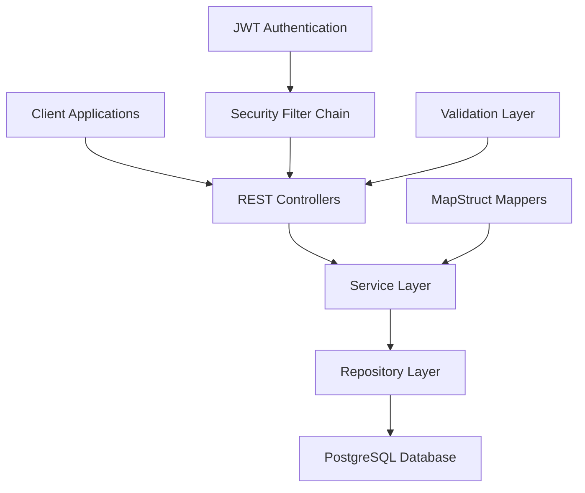
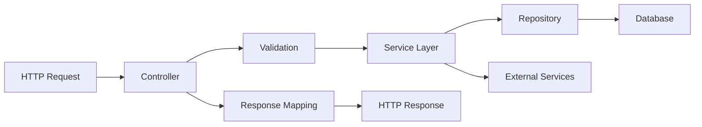
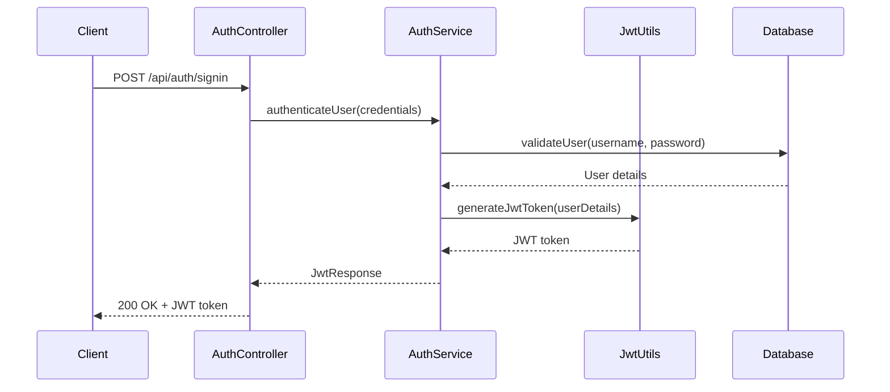
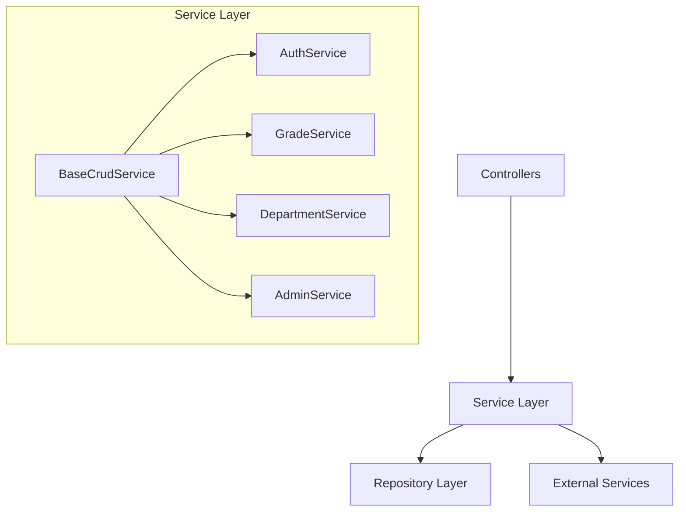
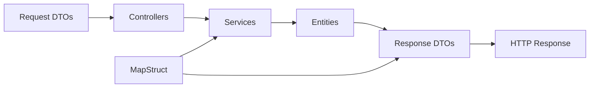
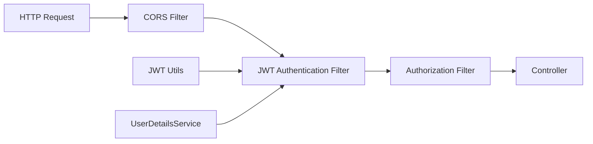
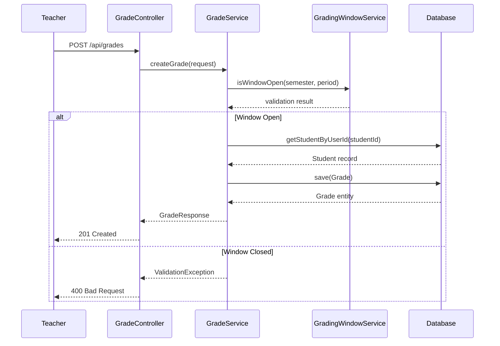
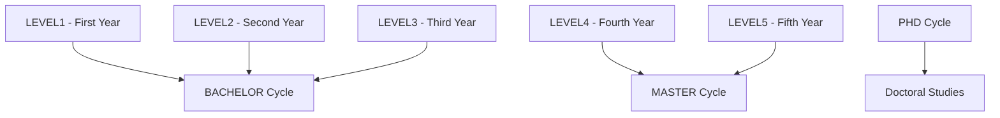
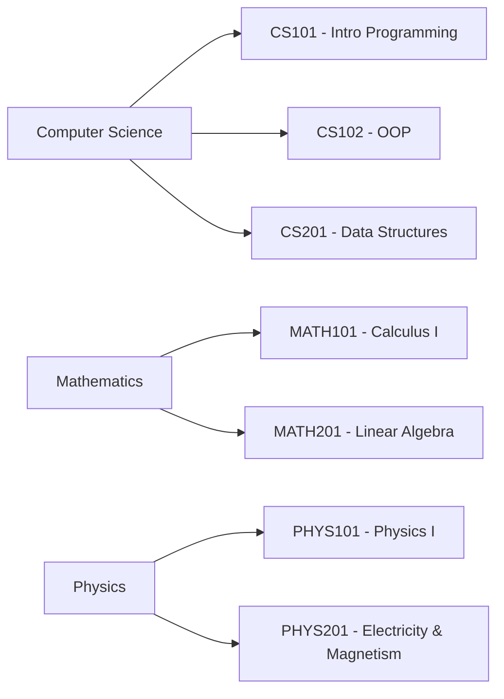

# ManageNotes – Technical Documentation

> Comprehensive technical documentation for the ManageNotes University Grade Management System. Updated August 2025 to reflect the current backend architecture and implementation.

## Table of Contents
1. [System Overview](#system-overview)
2. [Architecture & Technology Stack](#architecture--technology-stack)
3. [Database Schema & Domain Model](#database-schema--domain-model)
4. [API Layer Architecture](#api-layer-architecture)
5. [Security Implementation](#security-implementation)
6. [Business Logic & Services](#business-logic--services)
7. [Data Transfer Objects (DTOs)](#data-transfer-objects-dtos)
8. [API Endpoints Reference](#api-endpoints-reference)
9. [Authentication & Authorization](#authentication--authorization)
10. [Grade Management System](#grade-management-system)
11. [Academic Structure](#academic-structure)
12. [Error Handling & Validation](#error-handling--validation)
13. [Configuration & Deployment](#configuration--deployment)
14. [Development Guidelines](#development-guidelines)

---

## System Overview

ManageNotes is a comprehensive university grade management system built with Spring Boot 3.5.3, designed to handle academic operations for administrators, teachers, and students. The system provides secure role-based access control, grade management, academic reporting, and administrative functions.

### Key Features
- **Multi-role Authentication**: JWT-based authentication for Admin, Teacher, and Student roles
- **Grade Management**: Complete CRUD operations with validation and grading windows
- **Academic Structure**: Department, subject, semester, and student management
- **Grade Claims**: Student-initiated grade dispute system with approval workflow
- **Reporting**: Academic transcripts and performance reports
- **Audit Trail**: Complete tracking of changes and user actions

### System Capabilities
- Real-time grade entry validation
- Time-controlled grading windows
- Bulk operations for administrative tasks
- Foreign key constraint handling with cascade operations
- Comprehensive API documentation via Swagger/OpenAPI

---

## Architecture & Technology Stack

### Technology Stack
- **Java 21** - Latest LTS version with modern language features
- **Spring Boot 3.5.3** - Main application framework
- **Spring Security 6.5.1** - Authentication and authorization
- **Spring Data JPA 3.5.1** - Data persistence layer
- **PostgreSQL 17.5** - Primary database
- **JWT (JSON Web Tokens)** - Stateless authentication
- **MapStruct 1.6.0** - Entity-DTO mapping
- **Lombok** - Boilerplate code reduction
- **Swagger/OpenAPI 3** - API documentation
- **Maven 3.9+** - Build and dependency management

### Architectural Patterns


### Package Structure
```
com.university.ManageNotes/
├── config/                 # Configuration classes
├── controller/             # REST endpoints
├── dto/                   # Data Transfer Objects
│   ├── Request/           # Request DTOs
│   └── Response/          # Response DTOs
├── mapper/                # MapStruct mappers
├── model/                 # JPA entities
├── repository/            # Data access layer
├── security/              # Security components
├── service/               # Business logic
└── util/                  # Utility classes
```

### Layered Architecture
| Layer | Responsibility | Components |
|-------|---------------|------------|
| **Presentation** | HTTP endpoints, request/response handling | Controllers, DTOs |
| **Business** | Business logic, validation, orchestration | Services |
| **Persistence** | Data access, repository pattern | Repositories, Entities |
| **Security** | Authentication, authorization, JWT | Security filters, JWT utils |

---

## Database Schema & Domain Model

### Core Entities

```mermaid
erDiagram
    USERS {
        bigint id PK
        varchar username UK
        varchar email UK
        varchar password
        varchar role
        varchar first_name
        varchar last_name
        boolean active
        timestamp creation_date
        timestamp last_modified_date
    }
    
    STUDENTS {
        bigint id PK
        varchar matricule UK
        varchar first_name
        varchar last_name
        varchar email
        varchar level
        varchar cycle
        varchar speciality
        date date_of_birth
        varchar place_of_birth
        timestamp creation_date
        timestamp last_modified_date
    }
    
    DEPARTMENTS {
        bigint id PK
        varchar name UK
        timestamp creation_date
        timestamp last_modified_date
    }
    
    SUBJECT {
        bigint id PK
        varchar name
        varchar code UK
        decimal credits
        varchar description
        boolean active
        varchar level
        varchar cycle
        bigint id_teacher FK
        bigint department_id FK
        bigint id_semester FK
        timestamp creation_date
        timestamp last_modified_date
        UK uk_teacher_level "(id_teacher, level)"
    }
    
    SEMESTERS {
        bigint id PK
        varchar name
        date start_date
        date end_date
        boolean active
        integer order_index
        timestamp creation_date
        timestamp last_modified_date
    }
    
    GRADES {
        bigint id PK
        double value
        double max_value
        varchar grade_type
        varchar period_type
        varchar comments
        bigint id_students FK
        bigint id_subject FK
        bigint id_semester FK
        bigint id_users FK
        timestamp creation_date
        timestamp last_modified_date
    }
    
    GRADE_CLAIMS {
        bigint id PK
        bigint grade_id FK
        bigint student_id FK
        double requested_score
        varchar status
        varchar cause
        varchar description
        varchar period_label
        varchar rejection_reason
        text teacher_comment
        bigint created_by_id FK
        bigint semester_id FK
        timestamp resolved_at
        timestamp creation_date
        timestamp last_modified_date
    }
    
    GRADING_WINDOW {
        bigint id PK
        varchar name
        date start_date
        date end_date
        boolean is_active
        varchar period_label
        integer period_type
        integer order_index
        varchar color
        varchar short_name
        bigint id_semester FK
        timestamp creation_date
        timestamp last_modified_date
    }

    USERS ||--o{ GRADES : "enters"
    STUDENTS ||--o{ GRADES : "receives"
    SUBJECT ||--o{ GRADES : "for"
    SEMESTERS ||--o{ GRADES : "in"
    DEPARTMENTS ||--o{ SUBJECT : "contains"
    USERS ||--o{ SUBJECT : "teaches"
    SEMESTERS ||--o{ GRADING_WINDOW : "has"
    GRADES ||--o{ GRADE_CLAIMS : "disputed"
    STUDENTS ||--o{ GRADE_CLAIMS : "submits"
```

### Entity Relationships

#### Users & Students
- **Users** table stores authentication and basic user information
- **Students** table stores academic-specific information
- Relationship: Users.username = Students.matricule (for student users)

#### Academic Structure
- **Departments** contain multiple **Subjects**
- **Subjects** are taught by **Users** (teachers) and belong to **Semesters**
- **Grades** link Students, Subjects, and Semesters with the entering User

#### Grade Management
- **Grades** store individual assessment scores
- **Grade Claims** allow students to dispute grades
- **Grading Windows** control when grades can be entered

### Enums and Constants

```java
// Student Academic Levels
public enum StudentLevel {
    LEVEL1(1), LEVEL2(2), LEVEL3(3), LEVEL4(4), LEVEL5(5)
}

// Academic Cycles
public enum StudentCycle {
    BACHELOR, MASTER, PHD
}

// User Roles
public enum Role {
    ADMIN, TEACHER, STUDENT
}

// Grade Types
public enum GradeType {
    CC_1, CC_2, SN_1, SN_2
}

// Period Types
public enum PeriodType {
    CC_1, CC_2, SN_1, SN_2
}

// Request Status
public enum RequestStatus {
    PENDING, APPROVED, REJECTED
}
```

---

## API Layer Architecture

### Controller Design Pattern



### Base Controller Structure
```java
@RestController
@RequestMapping("/api")
@SecurityRequirement(name = "Bearer Authentication")
@Tag(name = "Controller Name", description = "Description")
public class ExampleController {
    
    private final ExampleService service;
    
    @GetMapping
    @PreAuthorize("hasRole('ROLE')")
    @Operation(summary = "Description")
    public ResponseEntity<List<ResponseDTO>> getAll() {
        return ResponseEntity.ok(service.getAll());
    }
}
```

### Controller Hierarchy

#### Core Controllers
- **AuthController** (`/api/auth`) - Authentication and user management
- **UserController** (`/api`) - User operations and profile management
- **AdminController** (`/api/admin`) - Administrative operations

#### Academic Controllers
- **DepartmentController** (`/api/departments`) - Department management
- **SubjectController** (`/api/subjects`) - Subject management
- **SemesterController** (`/api/semesters`) - Semester management

#### Grade Management Controllers
- **GradeController** (`/api/grades`) - Grade CRUD operations
- **GradeClaimController** (`/api/grade-claims`) - Grade dispute system
- **GradingWindowController** (`/api/grading-windows`) - Grading period management

### Request/Response Flow
1. **Request Validation** - Bean validation on DTOs
2. **Security Check** - JWT token validation and role authorization
3. **Service Delegation** - Business logic execution
4. **Data Mapping** - Entity to DTO conversion
5. **Response Formation** - HTTP response with appropriate status codes

---

## Security Implementation

### JWT Authentication Flow



### Security Configuration

```java
@Configuration
@EnableWebSecurity
@EnableMethodSecurity(prePostEnabled = true)
public class WebSecurityConfig {
    
    @Bean
    public SecurityFilterChain filterChain(HttpSecurity http) throws Exception {
        http.cors().and().csrf().disable()
            .sessionManagement().sessionCreationPolicy(SessionCreationPolicy.STATELESS)
            .authorizeHttpRequests(authz -> authz
                .requestMatchers("/api/auth/**").permitAll()
                .requestMatchers("/swagger-ui/**", "/v3/api-docs/**").permitAll()
                .requestMatchers(HttpMethod.GET, "/api/students").hasAnyRole("TEACHER", "ADMIN")
                .requestMatchers("/api/admin/**").hasRole("ADMIN")
                .anyRequest().authenticated()
            );
        
        http.addFilterBefore(authTokenFilter(), UsernamePasswordAuthenticationFilter.class);
        return http.build();
    }
}
```

### Role-Based Access Control

| Endpoint Pattern | Required Role | Description |
|-----------------|---------------|-------------|
| `/api/auth/**` | Public | Authentication endpoints |
| `/api/admin/**` | ADMIN | Administrative functions |
| `/api/students` (GET) | TEACHER, ADMIN | View students |
| `/api/grades` (POST/PUT) | TEACHER, ADMIN | Grade management |
| `/api/grade-claims` (POST) | STUDENT | Submit grade claims |
| `/api/departments` | ADMIN | Department management |

### JWT Token Structure
```json
{
  "sub": "username",
  "iat": 1693123456,
  "exp": 1693209856,
  "roles": ["ROLE_STUDENT"]
}
```

---

## Business Logic & Services

### Service Layer Architecture



### Core Services

#### AuthService
```java
@Service
@Transactional
public class AuthService {
    
    public JwtResponse authenticateUser(LoginRequest request) {
        // Authenticate user credentials
        // Generate JWT tokens
        // Return authentication response
    }
    
    public MessageResponse registerUser(SignupRequest request) {
        // Validate user data
        // Create user account
        // Send confirmation email
    }
}
```

#### GradeService
```java
@Service
@Transactional
public class GradeService {
    
    public GradeResponse createGrade(GradeRequest request) {
        // Validate grading window
        // Convert user ID to student ID
        // Create grade record
        // Return grade response
    }
    
    public StudentGradesResponse getStudentGrades(Long userId, Long semesterId) {
        // Convert user ID to student record
        // Fetch grades for student
        // Calculate GPA
        // Return aggregated response
    }
}
```

#### DepartmentService
```java
@Service
@Transactional
public class DepartmentService extends BaseCrudService<Department, Long, DepartmentRequest, DepartmentResponse> {
    
    public DepartmentResponse createDepartmentWithSubjects(DepartmentRequest request) {
        // Create department
        // Assign subjects if provided
        // Return department details
    }
    
    @Override
    public MessageResponse delete(Long id) {
        // Remove department references from subjects
        // Delete department safely
        // Return success message
    }
}
```

### Business Rules Implementation

#### Grade Entry Validation
1. **Grading Window Check** - Verify current time is within active grading window
2. **Teacher Authorization** - Ensure teacher is assigned to the subject
3. **Student Enrollment** - Verify student is enrolled in the subject
4. **Grade Range** - Validate grade value is within acceptable range (0-20)

#### Teacher Assignment Rules
- **One Subject Per Level**: A teacher can only be assigned to one subject per academic level
- **Level Constraint**: Database enforces unique constraint on (teacher_id, level)
- **Assignment Validation**: System validates teacher-level assignments during subject creation/update

#### ID Consistency Rules
- **Student Operations**: Always use User ID in API, convert to Student record ID internally
- **Teacher Operations**: Use User ID throughout
- **Admin Operations**: Use User ID for user management, entity IDs for other operations

#### Cascade Delete Handling
- **Department Deletion**: Remove department references from subjects before deletion
- **Teacher Deletion**: Unassign subjects and grades, preserve data for reassignment
- **Student Deletion**: Remove all associated grades and records

---

## Data Transfer Objects (DTOs)

### DTO Architecture



### Request DTOs

#### Authentication DTOs
```java
@Data
public class LoginRequest {
    @NotBlank
    private String username;
    
    @NotBlank
    private String password;
}

@Data
public class SignupRequest {
    @NotBlank
    @Size(min = 3, max = 20)
    private String username;
    
    @NotBlank
    @Email
    private String email;
    
    @NotBlank
    @Size(min = 6, max = 40)
    private String password;
    
    private String firstName;
    private String lastName;
    private Role role = Role.STUDENT;
}
```

#### Grade Management DTOs
```java
@Data
public class GradeRequest {
    @NotNull
    private Long studentId;  // User ID (converted internally)
    
    @NotNull
    private Long subjectId;
    
    @NotNull
    private Long semesterId;
    
    @NotNull
    @DecimalMin("0.0")
    @DecimalMax("20.0")
    private Double value;
    
    private Double maxValue = 20.0;
    
    @NotNull
    private GradeType type;
    
    @NotNull
    private PeriodType periodType;
    
    private String comments;
    
    @NotNull
    private Long enteredBy;
}

@Data
public class GradeClaimRequest {
    @NotNull
    private Long gradeId;
    
    @NotNull
    private Double requestedScore;
    
    @NotBlank
    private String cause;
    
    @NotNull
    private PeriodType period;
    
    @NotBlank
    private String description;
}
```

### Response DTOs

#### User Profile Response
```java
@Data
@Builder
@NoArgsConstructor
@AllArgsConstructor
public class UserProfileResponse {
    private Long id;
    private String username;
    private String firstName;
    private String lastName;
    private String email;
    private Role role;
    private StudentLevel level;        // For students
    private List<String> levels;       // For teachers
    private List<SubjectResponse> subjects;
}
```

#### Grade Response
```java
@Data
public class GradeResponse {
    private Long id;
    private Long studentId;           // User ID for API consistency
    private String studentName;
    private Long subjectId;
    private String subjectName;
    private String subjectCode;
    private Long semesterId;
    private String semesterName;
    private Double value;
    private GradeType type;
    private String periodLabel;
    private String comments;
    private Long enteredBy;
    private String enteredByName;
    private Boolean passed;
    private BigDecimal creditsEarned;
    private Instant createdDate;
    private Instant lastModifiedDate;
}
```

### DTO Validation Rules

| Validation | Purpose | Example |
|------------|---------|---------|
| `@NotNull` | Required fields | `@NotNull private Long studentId` |
| `@NotBlank` | Non-empty strings | `@NotBlank private String username` |
| `@Email` | Email format | `@Email private String email` |
| `@Size` | String length | `@Size(min = 3, max = 20)` |
| `@DecimalMin/Max` | Numeric range | `@DecimalMax("20.0")` |
| `@Pattern` | Regex validation | `@Pattern(regexp = "^[A-Z]{2}[0-9]{3}$")` |

---

## API Endpoints Reference

### Authentication Endpoints (`/api/auth`)

| Method | Endpoint | Request | Response | Description |
|--------|----------|---------|----------|-------------|
| POST | `/signin` | `LoginRequest` | `JwtResponse` | User authentication |
| POST | `/signup` | `SignupRequest` | `MessageResponse` | User registration |
| POST | `/refresh` | `TokenRefreshRequest` | `JwtResponse` | Token refresh |

### User Management (`/api`)

| Method | Endpoint | Request | Response | Roles | Description |
|--------|----------|---------|----------|-------|-------------|
| GET | `/me` | - | `UserProfileResponse` | Any | Current user profile |
| GET | `/students` | - | `List<UserProfileResponse>` | TEACHER, ADMIN | List students |
| GET | `/teachers` | - | `List<UserProfileResponse>` | ADMIN | List teachers |
| PUT | `/students/{id}` | `StudentUpdateRequest` | `UserProfileResponse` | ADMIN | Update student |
| DELETE | `/users/{id}` | - | `MessageResponse` | ADMIN | Delete user |

### Academic Management

#### Departments (`/api/departments`)
| Method | Endpoint | Request | Response | Roles | Description |
|--------|----------|---------|----------|-------|-------------|
| GET | `/` | - | `List<DepartmentResponse>` | ADMIN | List departments (newest first) |
| POST | `/` | `DepartmentRequest` | `MessageResponse` | ADMIN | Create department |
| DELETE | `/{id}` | - | `MessageResponse` | ADMIN | Delete department |

#### Subjects (`/api/subjects`)
| Method | Endpoint | Request | Response | Roles | Description |
|--------|----------|---------|----------|-------|-------------|
| GET | `/` | - | `List<SubjectResponse>` | Any | List subjects (newest first) |
| POST | `/` | `SubjectRequest` | `MessageResponse` | ADMIN | Create subject |
| PUT | `/{id}` | `SubjectRequest` | `MessageResponse` | ADMIN | Update subject |
| DELETE | `/{id}` | - | `MessageResponse` | ADMIN | Delete subject |

#### Semesters (`/api/semesters`)
| Method | Endpoint | Request | Response | Roles | Description |
|--------|----------|---------|----------|-------|-------------|
| GET | `/` | - | `List<SemesterResponse>` | ADMIN | List semesters |
| POST | `/` | `SemesterRequest` | `MessageResponse` | ADMIN | Create semester |
| PUT | `/` | `List<SemesterRequest>` | `MessageResponse` | ADMIN | Bulk update semesters |
| PUT | `/{id}` | `SemesterRequest` | `MessageResponse` | ADMIN | Update semester |
| DELETE | `/{id}` | - | `MessageResponse` | ADMIN | Delete semester |

### Grade Management

#### Grades (`/api/grades`)
| Method | Endpoint | Request | Response | Roles | Description |
|--------|----------|---------|----------|-------|-------------|
| POST | `/` | `GradeRequest` | `GradeResponse` | TEACHER, ADMIN | Create grade |
| GET | `/student/{id}` | - | `StudentGradesResponse` | STUDENT (self), TEACHER, ADMIN | Get student grades |
| PUT | `/{id}` | `GradeUpdateRequest` | `GradeResponse` | TEACHER, ADMIN | Update grade |
| DELETE | `/{id}` | - | `MessageResponse` | TEACHER, ADMIN | Delete grade |

#### Grade Claims (`/api/grade-claims`)
| Method | Endpoint | Request | Response | Roles | Description |
|--------|----------|---------|----------|-------|-------------|
| POST | `/` | `GradeClaimRequest` | `MessageResponse` | STUDENT | Submit grade claim |
| GET | `/` | - | `List<GradeClaimResponse>` | TEACHER, ADMIN | List grade claims |
| PUT | `/{id}/decision` | `GradeClaimDecisionRequest` | `MessageResponse` | TEACHER, ADMIN | Approve/reject claim |

### Administrative Endpoints (`/api/admin`)

| Method | Endpoint | Request | Response | Description |
|--------|----------|---------|----------|-------------|
| PUT | `/students/{id}` | `StudentUpdateRequest` | `MessageResponse` | Update student (admin) |
| PUT | `/subjects/{id}` | `SubjectRequest` | `MessageResponse` | Update subject (admin) |

---

## Authentication & Authorization

### JWT Token Management

#### Token Generation
```java
public String generateJwtToken(UserPrincipal userPrincipal) {
    return Jwts.builder()
        .setSubject(userPrincipal.getUsername())
        .setIssuedAt(new Date())
        .setExpiration(new Date(System.currentTimeMillis() + jwtExpirationMs))
        .signWith(SignatureAlgorithm.HS512, jwtSecret)
        .compact();
}
```

#### Token Validation
```java
public boolean validateJwtToken(String authToken) {
    try {
        Jwts.parser().setSigningKey(jwtSecret).parseClaimsJws(authToken);
        return true;
    } catch (SignatureException | MalformedJwtException | ExpiredJwtException | 
             UnsupportedJwtException | IllegalArgumentException e) {
        logger.error("Invalid JWT token: {}", e.getMessage());
        return false;
    }
}
```

### Role-Based Method Security

```java
@PreAuthorize("hasRole('ADMIN')")
public MessageResponse deleteUser(Long id) { ... }

@PreAuthorize("hasAnyRole('TEACHER', 'ADMIN')")
public List<UserProfileResponse> getStudents() { ... }

@PreAuthorize("hasRole('STUDENT') and #userId == authentication.principal.id")
public StudentGradesResponse getMyGrades(Long userId) { ... }
```

### Security Filter Chain



---

## Grade Management System

### Grade Entry Workflow



### Grade Calculation Logic

#### Individual Grade Processing
```java
public GradeResponse createGrade(GradeRequest request) {
    // 1. Validate grading window
    if (!gradingWindowService.isWindowOpen(request.getSemesterId(), request.getPeriodType())) {
        throw new ValidationException("Grading window is closed");
    }
    
    // 2. Convert user ID to student record
    Students student = getStudentByUserId(request.getStudentId());
    
    // 3. Create and save grade
    Grades grade = new Grades();
    grade.setStudent(student);
    grade.setValue(request.getValue());
    // ... set other properties
    
    Grades saved = gradeRepository.save(grade);
    return convertToResponse(saved);
}
```

#### GPA Calculation
```java
public double calculateGPA(List<Grades> grades) {
    return grades.stream()
        .mapToDouble(Grades::getValue)
        .average()
        .orElse(0.0);
}
```

### Grading Windows

#### Window Configuration
- **CC_1**: September 15, 2025 - October 15, 2025
- **SN_1**: January 15, 2026 - February 15, 2026
- **CC_2**: March 22, 2026 - April 22, 2026
- **SN_2**: May 15, 2026 - June 1, 2026

#### Window Validation Logic
```java
public boolean isWindowOpen(Long semesterId, PeriodType periodType) {
    Optional<GradingWindow> window = gradingWindowRepository
        .findBySemesterIdAndPeriodType(semesterId, periodType);
    
    if (window.isEmpty()) return false;
    
    LocalDate now = LocalDate.now();
    GradingWindow gw = window.get();
    
    return !now.isBefore(gw.getStartDate()) && 
           !now.isAfter(gw.getEndDate()) && 
           gw.getIsActive();
}
```

---

## Academic Structure

### Student Level System



### Academic Periods

#### Semester Structure
- **Semester 1**: September 8, 2025 - February 23, 2026
- **Semester 2**: March 15, 2026 - June 2, 2026

#### Assessment Periods
- **CC_1/CC_2**: Continuous Assessment (Contrôle Continu)
- **SN_1/SN_2**: Normal Session (Session Normale)

### Department-Subject Relationship



---

## Error Handling & Validation

### Error Response Structure

```java
@Data
public class ErrorResponse {
    private String message;
    private String status;
    private int code;
    private String timestamp;
    private String path;
    
    public static class FieldError {
        private String field;
        private String message;
    }
}
```

### Global Exception Handler

```java
@RestControllerAdvice
public class GlobalExceptionHandler {
    
    @ExceptionHandler(ValidationException.class)
    public ResponseEntity<ErrorResponse> handleValidation(ValidationException ex) {
        ErrorResponse error = new ErrorResponse();
        error.setMessage(ex.getMessage());
        error.setStatus("VALIDATION_ERROR");
        error.setCode(400);
        return ResponseEntity.badRequest().body(error);
    }
    
    @ExceptionHandler(MethodArgumentNotValidException.class)
    public ResponseEntity<ValidationErrorResponse> handleMethodArgumentNotValid(
            MethodArgumentNotValidException ex) {
        
        ValidationErrorResponse error = new ValidationErrorResponse();
        error.setMessage("Validation failed");
        error.setStatus("error");
        
        List<FieldError> fieldErrors = ex.getBindingResult()
            .getFieldErrors()
            .stream()
            .map(fe -> new FieldError(fe.getField(), fe.getDefaultMessage()))
            .collect(Collectors.toList());
            
        error.setErrors(fieldErrors);
        return ResponseEntity.badRequest().body(error);
    }
}
```

### HTTP Status Code Mapping

| Status Code | Scenario | Response Type |
|-------------|----------|---------------|
| 200 | Success | Data response |
| 201 | Created | Success message |
| 400 | Validation error | Error details |
| 401 | Unauthorized | Error message |
| 403 | Forbidden | Error message |
| 404 | Not found | Error message |
| 409 | Conflict | Error message |
| 500 | Server error | Error message |

### Validation Rules

#### Grade Validation
- Value must be between 0.0 and 20.0
- Student must exist and be active
- Subject must exist and be active
- Grading window must be open
- Teacher must be authorized for the subject

#### User Validation
- Username must be unique and 3-20 characters
- Email must be valid format and unique
- Password must be 6-40 characters
- Role must be valid enum value

---

## Configuration & Deployment

### Application Configuration

#### Database Configuration
```properties
# Database
spring.datasource.url=jdbc:postgresql://localhost:5432/managerNotes
spring.datasource.username=postgres
spring.datasource.password=nathan
spring.datasource.driver-class-name=org.postgresql.Driver

# JPA/Hibernate
spring.jpa.hibernate.ddl-auto=update
spring.jpa.show-sql=false
spring.jpa.properties.hibernate.format_sql=true
```

#### Security Configuration
```properties
# JWT Configuration
app.jwtSecret=R2RThdHu3OKhHvJ3QgUnkQsVv8Af+Jsw9A9+1oSx6nE=
app.jwtExpirationMs=86400000

# Security
spring.security.enabled=true
```

#### Server Configuration
```properties
# Server
server.port=3030

# File Upload
spring.servlet.multipart.max-file-size=10MB
spring.servlet.multipart.max-request-size=10MB
```

### Environment Variables

| Variable | Default | Description |
|----------|---------|-------------|
| `DB_PASSWORD` | `nathan` | Database password |
| `DB_URL` | `jdbc:postgresql://localhost:5432/managerNotes` | Database URL |
| `JWT_SECRET` | Generated | JWT signing secret |
| `JWT_EXPIRATION` | `86400000` | Token expiration (24h) |
| `EMAIL_USERNAME` | - | SMTP username |
| `EMAIL_PASSWORD` | - | SMTP password |

### Database Setup

#### PostgreSQL Installation
```bash
# Ubuntu/Debian
sudo apt update && sudo apt install postgresql postgresql-contrib

# Create database
sudo -u postgres createdb managerNotes
sudo -u postgres psql -c "ALTER USER postgres PASSWORD 'nathan';"
```

#### Schema Initialization
```sql
-- Import initial schema
psql -h localhost -U postgres -d managerNotes -f src/main/resources/managerNotes.sql

-- Fix sequence issues (if needed)
ALTER TABLE departments ALTER COLUMN id SET DEFAULT nextval('departments_seq');
ALTER TABLE grade_claims ALTER COLUMN id SET DEFAULT nextval('grade_claims_seq');
```

### Production Deployment

#### Docker Configuration
```dockerfile
FROM openjdk:21-jdk-slim
COPY target/ManageNotes-0.0.1-SNAPSHOT.jar app.jar
EXPOSE 3030
ENTRYPOINT ["java", "-jar", "/app.jar"]
```

#### Production Properties
```properties
# Production Database
spring.datasource.url=${DB_URL}
spring.datasource.username=${DB_USERNAME}
spring.datasource.password=${DB_PASSWORD}

# Security
spring.jpa.hibernate.ddl-auto=validate
spring.jpa.show-sql=false
logging.level.org.hibernate.SQL=WARN

# Performance
spring.jpa.properties.hibernate.jdbc.batch_size=20
spring.jpa.properties.hibernate.order_inserts=true
spring.jpa.properties.hibernate.order_updates=true
```

---

## Development Guidelines

### Code Organization Principles

#### Package Structure Rules
- **Controllers**: Handle HTTP requests/responses only
- **Services**: Contain business logic and orchestration
- **Repositories**: Data access layer with custom queries
- **DTOs**: Data transfer between layers
- **Entities**: JPA entities with minimal business logic

#### Naming Conventions
- **Classes**: PascalCase (e.g., `UserController`, `GradeService`)
- **Methods**: camelCase (e.g., `createGrade`, `validateUser`)
- **Constants**: UPPER_SNAKE_CASE (e.g., `MAX_GRADE_VALUE`)
- **Database**: snake_case (e.g., `student_id`, `creation_date`)

### Best Practices

#### Service Layer
```java
@Service
@Transactional
@RequiredArgsConstructor
public class ExampleService {
    
    private final ExampleRepository repository;
    private final ExampleMapper mapper;
    
    public ExampleResponse create(ExampleRequest request) {
        // 1. Validate input
        validateRequest(request);
        
        // 2. Convert to entity
        Example entity = mapper.toEntity(request);
        
        // 3. Business logic
        processBusinessRules(entity);
        
        // 4. Save and return
        Example saved = repository.save(entity);
        return mapper.toResponse(saved);
    }
}
```

#### Error Handling
```java
// Use specific exceptions
throw new ValidationException("Grade value must be between 0 and 20");

// Use Optional for null safety
return repository.findById(id)
    .map(mapper::toResponse)
    .orElseThrow(() -> new EntityNotFoundException("User not found"));
```

#### Testing Guidelines
```java
@SpringBootTest
@Transactional
class GradeServiceTest {
    
    @Autowired
    private GradeService gradeService;
    
    @Test
    void shouldCreateGradeSuccessfully() {
        // Given
        GradeRequest request = createValidGradeRequest();
        
        // When
        GradeResponse response = gradeService.createGrade(request);
        
        // Then
        assertThat(response.getValue()).isEqualTo(request.getValue());
        assertThat(response.getStudentId()).isEqualTo(request.getStudentId());
    }
}
```

### API Design Standards

#### RESTful Conventions
- Use HTTP methods appropriately (GET, POST, PUT, DELETE)
- Use plural nouns for resource names (`/students`, `/grades`)
- Use HTTP status codes correctly
- Include proper error messages and validation feedback

#### Response Consistency
```java
// Success responses
return ResponseEntity.ok(data);
return ResponseEntity.status(HttpStatus.CREATED).body(MessageResponse.success("Created"));

// Error responses
return ResponseEntity.badRequest().body(ErrorResponse.validation("Invalid input"));
return ResponseEntity.status(HttpStatus.FORBIDDEN).body(ErrorResponse.forbidden("Access denied"));
```

### Security Guidelines

#### Input Validation
- Always validate DTOs with Bean Validation annotations
- Sanitize user input to prevent injection attacks
- Use parameterized queries in custom repository methods

#### Authentication & Authorization
- Always use `@PreAuthorize` for method-level security
- Validate JWT tokens on every protected endpoint
- Implement proper role-based access control

#### Data Protection
- Never log sensitive information (passwords, tokens)
- Use HTTPS in production
- Implement proper CORS configuration

---

**Document Version**: 1.0  
**Last Updated**: August 2025  
**Maintainer**: University Development Team

This technical documentation reflects the current state of the ManageNotes system and should be updated as the system evolves.